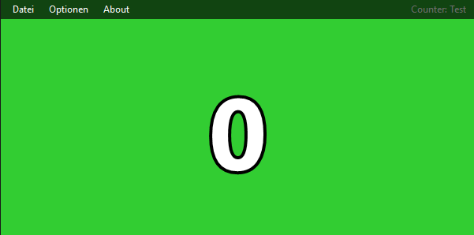
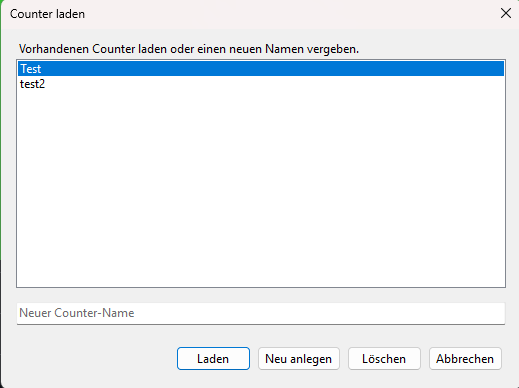
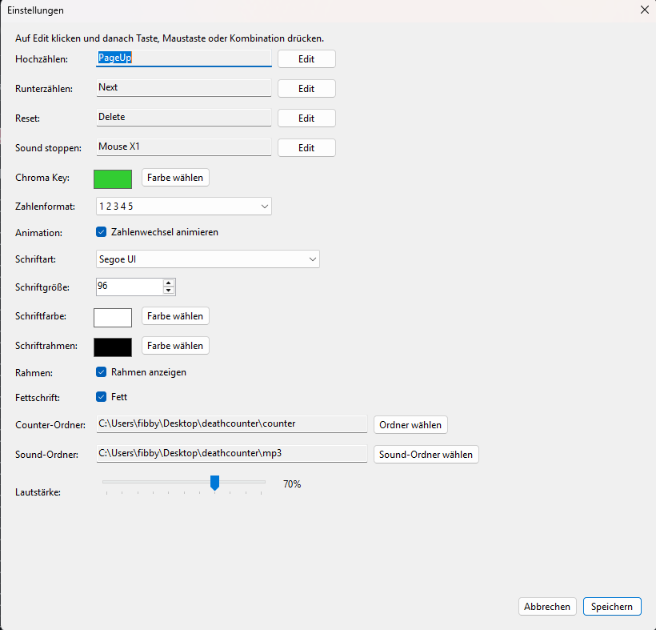
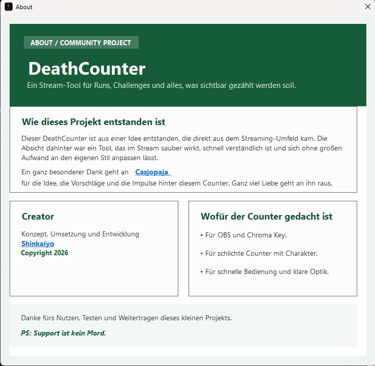

# DeathCounter

Ein anpassbarer DeathCounter für Streams, OBS und Chroma-Key-Setups.

## Vorschau









## Open Source

Dieses Projekt ist Open Source und steht unter der **GNU General Public License v3.0**.

Die vollständigen Lizenzbedingungen findest du in der Datei [LICENSE](./LICENSE).

## Wichtig zur Nutzung und Weitergabe

Wenn du dieses Projekt oder abgeleitete Versionen weitergibst, musst du die Bedingungen der **GNU GPL v3.0** einhalten. Dazu gehört insbesondere:

- Die Lizenz- und Copyright-Hinweise müssen erhalten bleiben.
- Empfänger müssen ebenfalls Zugriff auf den Quellcode unter GPL v3.0 erhalten.
- Änderungen am Projekt dürfen nicht unter zusätzliche, einschränkende Bedingungen gestellt werden, die der GPL widersprechen.

## Hinweis zur Verlinkung

Wenn du dieses System öffentlich nutzt, weitergibst oder in ein eigenes Projekt einbaust, ist eine Verlinkung auf diese GitHub-Seite ausdrücklich erwünscht.

Wichtig:
Dieser Hinweis ist bewusst als Bitte formuliert und nicht als zusätzliche Lizenzpflicht. Der Grund ist rechtlich einfach: Die **GNU GPL v3.0** erlaubt keine beliebigen zusätzlichen Einschränkungen. Eine harte Pflicht wie „Du musst auf diese GitHub-Seite verlinken“ wäre in vielen Fällen nicht sauber mit GPL v3.0 vereinbar.

Wenn du eine rechtlich bindende Pflicht zur Verlinkung oder Nennung erzwingen willst, brauchst du statt einer reinen GPL-Lizenz ein anderes Lizenzmodell oder eine individuell geprüfte Zusatzregelung.

## Sicherheitsprüfung

Die veröffentlichte Datei wurde zusätzlich über VirusTotal geprüft:

[VirusTotal-Scan öffnen](https://www.virustotal.com/gui/file/ab2f54220e73a0861ead50421fb07653d97a4a77b3ebac201c938dffd2cb886d?nocache=1)

Hinweis:
Bei selbstgebauten Single-File-.NET-Anwendungen können einzelne Scanner gelegentlich anschlagen, obwohl keine Schadsoftware enthalten ist. Entscheidend ist deshalb immer der vollständige Bericht und nicht nur ein einzelner Treffer.

## Credits

- Idee und Impulse: [Casjopaja_](https://www.twitch.tv/casjopaja_)
- Umsetzung und Entwicklung: [Shinkaiyo](https://www.twitch.tv/shinkaiyo)

## Features

- Counter mit globalen Hotkeys
- Unterstützung für Tastatur, Tastenkombinationen und Maustasten
- Mehrere Counter-Dateien
- Portabler Betrieb pro Ordner
- OBS- und Chroma-Key-tauglicher Hintergrund
- Zufällige Soundausgabe bei Counter-Erhöhung
- Unterstützung für MP3 und WAV
- Anpassbare Schrift, Farben, Outline und Animation

## Technik

Projektbasis:

- .NET 8
- Windows Forms
- NAudio

## Build

```powershell
dotnet build
```

## Release / Einzeldatei

```powershell
dotnet publish -c Release -r win-x64 --self-contained true -p:PublishSingleFile=true -p:IncludeNativeLibrariesForSelfExtract=true
```
